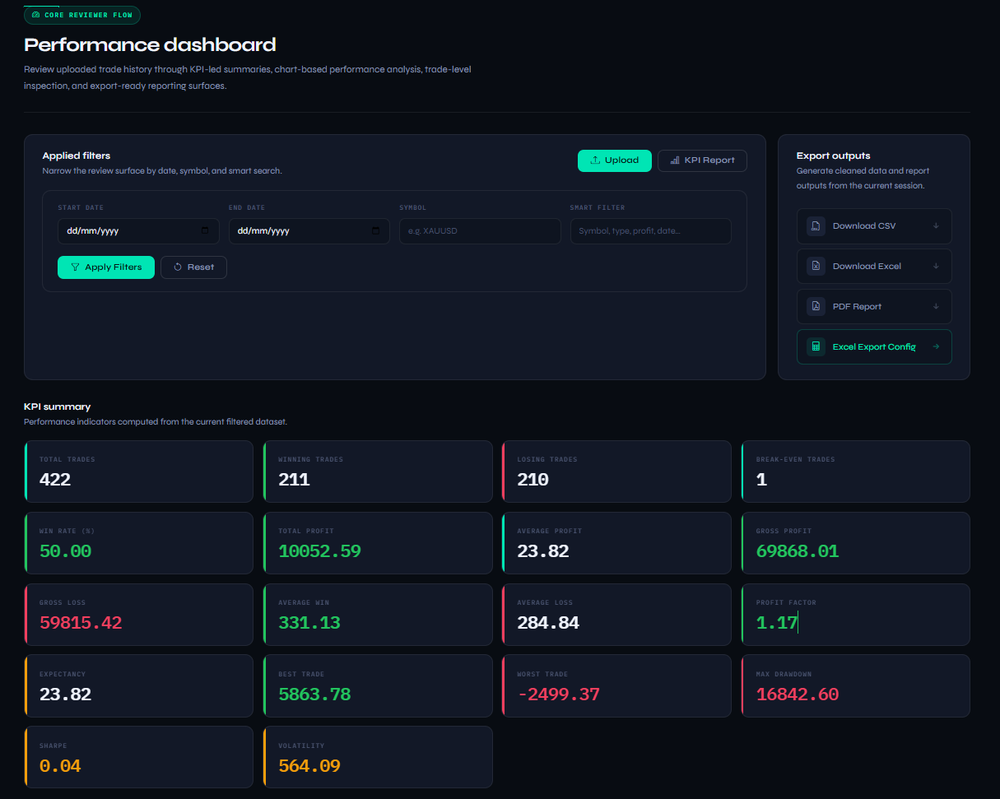
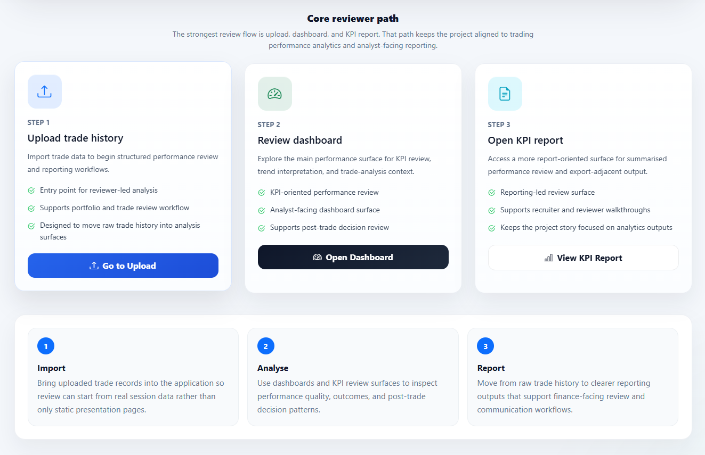
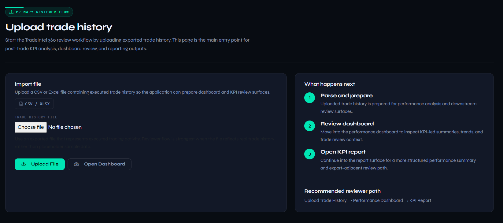
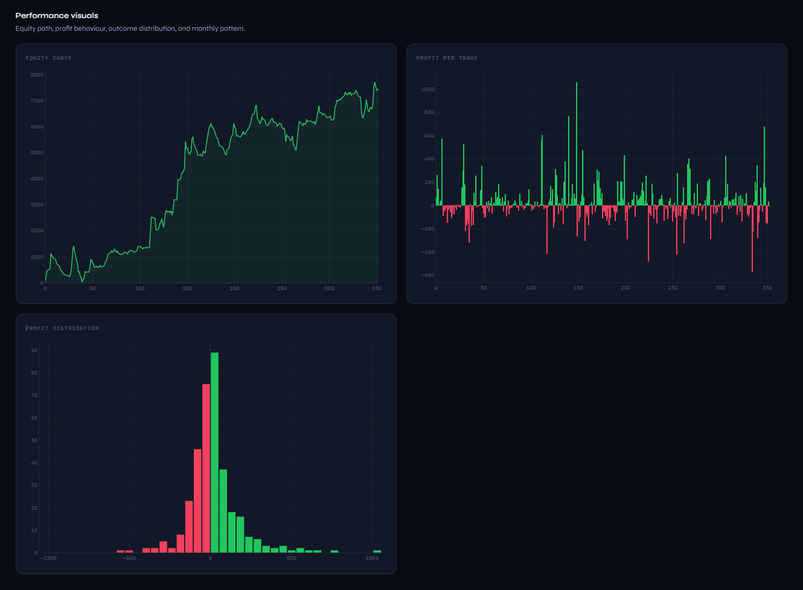
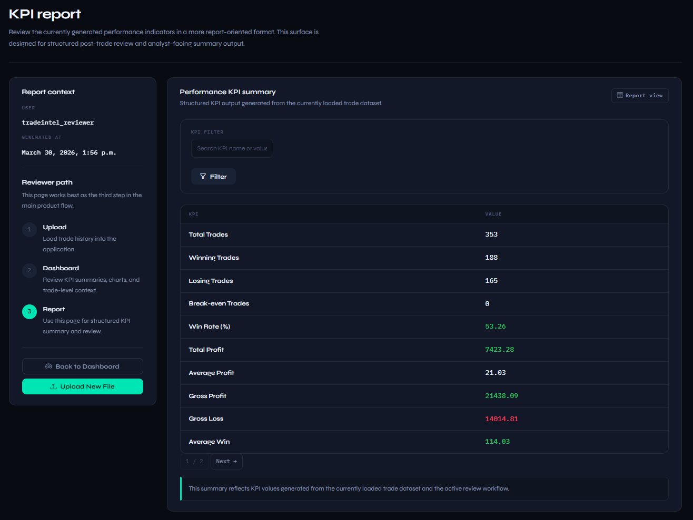
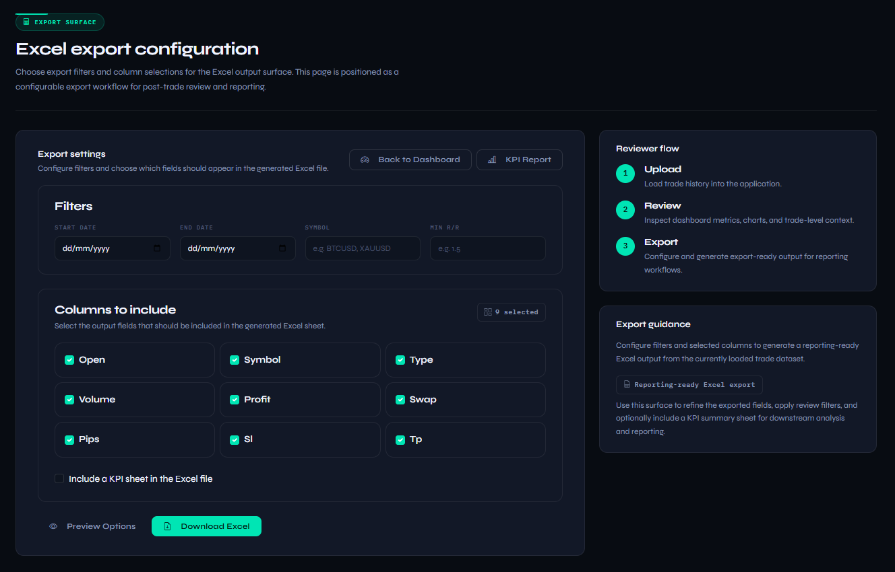
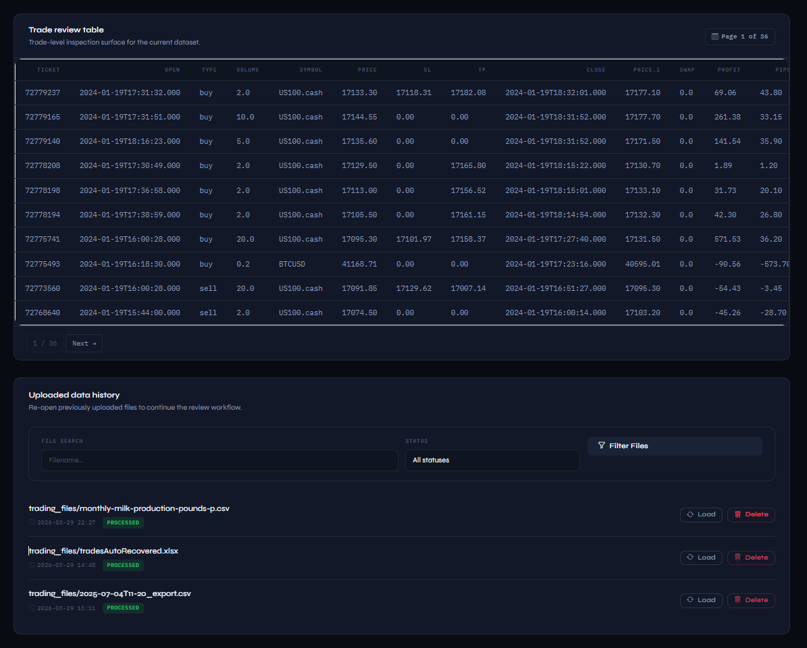

# TradeIntel 360

**Post-trade performance analytics built with Python, Django, Pandas, Plotly, and openpyxl.**

Upload a trade history CSV or Excel file — TradeIntel 360 cleans it, computes a 17-metric KPI suite, and surfaces the results across an interactive dashboard, a structured report view, and configurable export outputs. The review workflow runs from a single uploaded file and is designed to minimise manual preparation before analysis.


<br>

<table width="100%" cellpadding="0" cellspacing="0" border="0">
  <tr>
    <td align="center">
      
    </td>
  </tr>
  <tr>
    <td align="center" style="padding-top:6px">
      <sub><strong>Performance Dashboard</strong> — KPI summary, equity curve, and export controls</sub>
    </td>
  </tr>
</table>

<br>

---

## What this demonstrates

| Area | Detail |
|---|---|
| **Data pipeline** | Ingest raw CSV/XLSX → clean → normalise → session-backed analysis workflow |
| **KPI engine** | 17 computed metrics: win rate, profit factor, Sharpe, max drawdown, expectancy, and more |
| **Django patterns** | Login-gated views, file upload handling, session state, paginated tables, context-driven reporting |
| **Data visualisation** | Plotly equity curve, P&L distribution, monthly breakdown, segmented win/loss charts |
| **Export pipeline** | PDF via xhtml2pdf, configurable Excel with optional KPI sheet via openpyxl, cleaned CSV |
| **FinTech domain** | Trade-level data structures, performance metrics, analyst-facing workflow presentation |

---

## Core workflow

```
Upload CSV / XLSX
       ↓
Clean and normalise trade history
       ↓
Store cleaned DataFrame in session
       ↓
┌──────────────┬──────────────┬──────────────┬──────────────┐
│  Dashboard   │  KPI Report  │ Excel Export │  PDF Report  │
└──────────────┴──────────────┴──────────────┴──────────────┘
```

Session-driven: upload once, review across all surfaces without re-uploading. Dashboard filters (date range, symbol) update the active dataset and recompute KPIs live.

---

## Screenshots

<br>

<!-- Row 1: Onboarding + Upload -->
<table width="100%" cellpadding="0" cellspacing="0" border="0"
       style="border:1px solid #1e2d45;border-radius:10px;overflow:hidden;background:#0e1420">
  <tr>
    <td width="50%" valign="top"
        style="padding:20px 12px 20px 20px;border-right:1px solid #1e2d45">
      
    </td>
    <td width="50%" valign="top"
        style="padding:20px 20px 20px 12px">
      
    </td>
  </tr>
  <tr>
    <td valign="top"
        style="padding:10px 12px 16px 20px;border-right:1px solid #1e2d45;border-top:1px solid #1e2d45">
      <sub><strong>Reviewer onboarding path</strong><br>
      Step-by-step workflow guiding reviewers from upload to KPI report</sub>
    </td>
    <td valign="top"
        style="padding:10px 20px 16px 12px;border-top:1px solid #1e2d45">
      <sub><strong>Trade history upload</strong><br>
      CSV or XLSX upload with real-time session loading and status feedback</sub>
    </td>
  </tr>
</table>

<br>

<!-- Row 2: Dashboard KPIs + Charts -->
<table width="100%" cellpadding="0" cellspacing="0" border="0"
       style="border:1px solid #1e2d45;border-radius:10px;overflow:hidden;background:#0e1420">
  <tr>
    <td width="50%" valign="top"
        style="padding:20px 12px 20px 20px;border-right:1px solid #1e2d45">
      
    </td>
    <td width="50%" valign="top"
        style="padding:20px 20px 20px 12px">
      
    </td>
  </tr>
  <tr>
    <td valign="top"
        style="padding:10px 12px 16px 20px;border-right:1px solid #1e2d45;border-top:1px solid #1e2d45">
      <sub><strong>KPI summary panel</strong><br>
      17 computed metrics with date, symbol, and smart search filters</sub>
    </td>
    <td valign="top"
        style="padding:10px 20px 16px 12px;border-top:1px solid #1e2d45">
      <sub><strong>Performance visuals</strong><br>
      Equity curve, profit-per-trade bars, distribution histogram, monthly P&L</sub>
    </td>
  </tr>
</table>

<br>

<!-- Row 3: KPI Report + Excel Export -->
<table width="100%" cellpadding="0" cellspacing="0" border="0"
       style="border:1px solid #1e2d45;border-radius:10px;overflow:hidden;background:#0e1420">
  <tr>
    <td width="50%" valign="top"
        style="padding:20px 12px 20px 20px;border-right:1px solid #1e2d45">
      
    </td>
    <td width="50%" valign="top"
        style="padding:20px 20px 20px 12px">
      
    </td>
  </tr>
  <tr>
    <td valign="top"
        style="padding:10px 12px 16px 20px;border-right:1px solid #1e2d45;border-top:1px solid #1e2d45">
      <sub><strong>KPI report</strong><br>
      Structured performance summary with searchable metric table and report context panel</sub>
    </td>
    <td valign="top"
        style="padding:10px 20px 16px 12px;border-top:1px solid #1e2d45">
      <sub><strong>Excel export configuration</strong><br>
      Column selection, date and symbol filters, optional KPI sheet and metadata sheet</sub>
    </td>
  </tr>
</table>

<br>

<!-- Row 4: Trade review table (full width) -->
<table width="100%" cellpadding="0" cellspacing="0" border="0"
       style="border:1px solid #1e2d45;border-radius:10px;overflow:hidden;background:#0e1420">
  <tr>
    <td valign="top" style="padding:20px">
      
    </td>
  </tr>
  <tr>
    <td valign="top"
        style="padding:10px 20px 16px 20px;border-top:1px solid #1e2d45">
      <sub><strong>Trade review table</strong><br>
      Paginated trade-level inspection with smart search across symbol, type, notes, and date</sub>
    </td>
  </tr>
</table>

<br>

---

## KPI engine

All metrics are computed from the loaded dataset. Applying a date, symbol, or RR filter recomputes the full suite against the filtered subset.

**Volume & outcome** — total trades, wins, losses, break-evens, win rate

**Profit & loss** — total profit, average profit, gross profit, gross loss, average win, average loss, profit factor

**Risk metrics** — expectancy, best trade, worst trade, max drawdown

**Statistical** — trade-based Sharpe ratio, per-trade profit volatility

> Sharpe is computed as a trade-series ratio, not an annualised institutional Sharpe. Volatility refers to per-trade profit dispersion.

---

## Export surfaces

**PDF report** — full KPI summary rendered via xhtml2pdf, ready to share or archive.

**Cleaned CSV** — normalised version of the uploaded dataset.

**Configurable Excel export** — built with openpyxl, supports column selection, date range filter, symbol filter, minimum RR filter, optional KPI summary sheet, and export metadata sheet.

---

## Tech stack

| Layer | Technology |
|---|---|
| Backend | Python 3, Django 5 |
| Data processing | Pandas, openpyxl |
| Visualisation | Plotly |
| PDF generation | xhtml2pdf |
| Auth | Django auth, session management |
| Database | SQLite (local), PostgreSQL-ready |
| UI | Django templates, Bootstrap |

---

## Local setup

```bash
git clone https://github.com/aminul-portfolio/tradeintel-360.git
cd tradeintel-360

python -m venv .venv
source .venv/bin/activate          # Windows: .venv\Scripts\Activate.ps1

pip install -r requirements.txt
python manage.py migrate
python manage.py createsuperuser
python manage.py runserver
```

Visit `http://127.0.0.1:8000`, log in, and upload a trade history file to begin.

**Expected input:** CSV or XLSX with a `Profit` column and common trade fields (date/time, symbol, side/type). Reviewer-safe sample files are included in `sample_data/`.

---

## Review checklist

- [ ] Upload a CSV or XLSX file
- [ ] Confirm cleaned dataset loads into the dashboard
- [ ] Apply date and symbol filters — observe KPIs recompute
- [ ] Open the KPI report
- [ ] Configure and download the Excel export with optional KPI sheet
- [ ] Generate the PDF report

---

## Portfolio context

TradeIntel 360 is the **post-trade analytics** product in a four-project FinTech portfolio:

| Project | Domain |
|---|---|
| DataBridge Market API | Market data ingestion, ETL, API delivery |
| MarketVista Dashboard | Market monitoring and analyst visibility |
| RiskWise Planner | Pre-trade risk planning and scenario modelling |
| **TradeIntel 360** | **Post-trade performance analytics and review** |

---

## Target roles

Data Analyst (Finance / Trading) · Analytics Engineer (FinTech) · BI / Reporting Analyst · Python/Django data-product roles · Performance reporting and trade-review workflows in finance environments