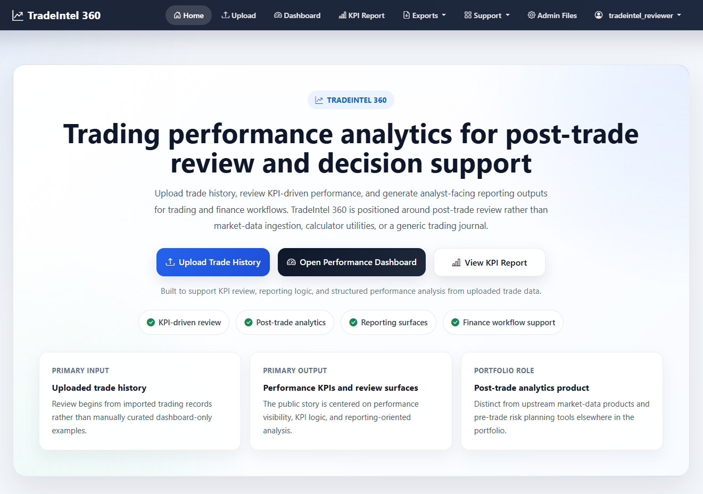
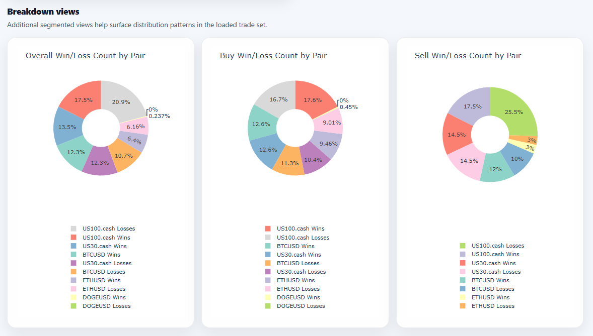

# TradeIntel 360 — Trading Performance Analytics

**TradeIntel 360** is a post-trade performance analytics data product built with **Python, Django, Pandas, Plotly, and openpyxl**. It turns uploaded trade history into KPI-driven review, dashboard-based analysis, report-style summary surfaces, and export-ready outputs for finance and trading workflows.

---

## What this project is

TradeIntel 360 is designed as a **post-trade analytics and review workflow**, not just a trading journal or a finance-themed Django app.

It is built to support:

- uploaded trade-history review
- KPI-driven performance analysis
- dashboard-based post-trade inspection
- trade-level review surfaces
- export-ready reporting outputs
- analyst-facing workflow presentation

---

## What this project is not

TradeIntel 360 is **not positioned mainly as**:

- a generic trading journal
- a market-data monitoring platform
- a pre-trade risk calculator suite
- a market-data API product
- a chart-only dashboard demo

Those responsibilities are deliberately separated from other projects in the wider portfolio.

---

## Overview

The strongest reviewer path is:

1. **Upload trade history**
2. **Review the performance dashboard**
3. **Open the KPI report**
4. **Use export surfaces for downstream reporting**

This keeps the project focused on post-trade analytics rather than mixed product identity.

---

## What this project proves

This project demonstrates:

- handling uploaded trading-history files
- cleaning and preparing uploaded data for review
- session-based analysis workflow from uploaded data
- KPI generation from loaded trade history
- dashboard-based performance inspection
- chart-based analysis surfaces
- trade-level review tables with filtering and pagination
- export-oriented reporting workflow
- reviewer-facing UI packaging in Django

---

## Proven features in the current repo

Based on the current implementation, the project supports:

- CSV/XLSX trade-history upload
- session-backed cleaned data workflow
- dashboard filters for date and symbol
- smart search across the trade review table
- KPI summary outputs from the loaded dataset
- chart outputs for:
  - equity curve
  - profit per trade
  - profit distribution histogram
  - monthly performance when date-like trade fields are present
  - segmented win/loss pie sections when the required fields are present
- paginated trade review table
- paginated uploaded-file history
- KPI report page
- PDF report generation
- cleaned CSV export
- cleaned Excel export
- configurable Excel export with:
  - selected-column export
  - date filtering
  - symbol filtering
  - minimum RR filtering where RR data exists
  - optional KPI sheet
  - export metadata sheet

---

## KPI definitions

TradeIntel 360 currently computes post-trade KPI outputs from the loaded trade dataset.

### Current KPI coverage

- **Total Trades** — count of rows with valid `Profit` values
- **Winning Trades** — trades where `Profit > 0`
- **Losing Trades** — trades where `Profit < 0`
- **Break-even Trades** — trades where `Profit = 0`
- **Win Rate (%)** — winning trades divided by total trades
- **Total Profit** — sum of `Profit`
- **Average Profit** — average `Profit` per trade
- **Gross Profit** — sum of positive `Profit` values
- **Gross Loss** — absolute sum of negative `Profit` values
- **Average Win** — average positive `Profit`
- **Average Loss** — absolute average negative `Profit`
- **Profit Factor** — gross profit divided by gross loss
- **Expectancy** — currently represented as average profit per trade
- **Best Trade** — maximum `Profit`
- **Worst Trade** — minimum `Profit`
- **Max Drawdown** — maximum peak-to-trough decline from cumulative profit
- **Sharpe** — currently a trade-based ratio derived from average profit and profit volatility
- **Volatility** — currently the standard deviation of per-trade profit

### KPI notes

- KPI outputs are computed from the currently loaded dataset.
- Date, symbol, and export filters can change the dataset being summarized.
- Sharpe in this project should be read as a **trade-based implementation**, not an annualized institutional Sharpe.
- Volatility in this project refers to **per-trade profit dispersion**, not market price volatility.

---

## Screenshots

### 1. Home / Hero


### 2. Home / Reviewer Path


### 3. Upload Trade History


### 4. Performance Dashboard — KPI Summary


### 5. Performance Dashboard — Visuals


### 6. Performance Dashboard — Breakdown Views


### 7. KPI Report


### 8. Excel Export Configuration


### 9. Trade Review Table


---

## Architecture / workflow

```text
Uploaded CSV/XLSX
        ↓
trade-history cleaning
        ↓
cleaned DataFrame stored in session
        ↓
filtered review workflow
        ├── Performance Dashboard
        ├── KPI Report
        ├── CSV Export
        ├── Excel Export
        └── PDF Report
```

### Workflow notes

- uploaded trade-history files are cleaned before analysis
- the cleaned dataset is stored in session for the active review flow
- dashboard and report surfaces are driven from the loaded dataset
- export outputs are generated from the same review context rather than static demo rows

---

## How to review this project

### 1. Clone the repo

```bash
git clone https://github.com/aminul-portfolio/tradeintel-360.git
cd tradeintel-360
```

### 2. Create and activate a virtual environment

#### Windows PowerShell

```powershell
python -m venv .venv
.venv\Scripts\Activate.ps1
```

#### macOS / Linux

```bash
python -m venv .venv
source .venv/bin/activate
```

### 3. Install dependencies

```bash
pip install -r requirements.txt
```

### 4. Apply migrations

```bash
python manage.py migrate
```

### 5. Create a reviewer account

```bash
python manage.py createsuperuser
```

### 6. Run the app

```bash
python manage.py runserver
```

### 7. Review the main workflow

After logging in, review the product in this order:

1. **Home**
2. **Upload Trade History**
3. **Performance Dashboard**
4. **KPI Report**
5. **Excel Export Configuration**
6. **CSV / Excel / PDF outputs**

### 8. Reviewer flow

To review the project properly:

1. log in
2. upload a CSV or Excel trade-history file
3. confirm the cleaned dataset loads into the session
4. review KPI outputs and charts in the dashboard
5. open the KPI report
6. export CSV, Excel, and PDF outputs
7. test filtered Excel export with optional KPI sheet

---

## Best role fit

TradeIntel 360 is best aligned to:

- **Trading Data Analyst**
- **Data Analyst [Finance / Trading]**
- **BI / Reporting Analyst**
- **Analytics Engineer [FinTech]**
- **Python/Django data-product roles**

---

## Best industry fit

This project is most relevant to:

- proprietary trading and funded trading workflows
- broker-adjacent analytics workflows
- performance reporting and trade-review teams
- analyst-facing FinTech products
- internal reporting and review tooling in finance environments

---

## Tech stack

- **Python**
- **Django**
- **Pandas**
- **Plotly**
- **openpyxl**
- **xhtml2pdf**
- **SQLite** for local development

---

## Local setup notes

### Requirements

Install dependencies from `requirements.txt`.

Typical project dependencies include:

- Django
- pandas
- plotly
- xhtml2pdf
- openpyxl
- Pillow
- supporting Django UI libraries used by the project

### Expected input

The main workflow expects a trade-history CSV/XLSX file with a usable `Profit` column and common trade-related fields such as date/time, symbol, side/type, and other trading columns where available.

---

## Verification

Use this checklist after setup:

- [ ] `python manage.py check` runs successfully
- [ ] app starts locally with `python manage.py runserver`
- [ ] login works
- [ ] CSV/XLSX upload works
- [ ] cleaned dataset loads into session
- [ ] dashboard filters work
- [ ] trade-table search works
- [ ] KPI report loads
- [ ] CSV export works
- [ ] Excel export works
- [ ] configurable Excel export works
- [ ] optional KPI sheet appears in Excel export
- [ ] PDF report generates successfully

---

## Portfolio context

**Analytics Engineer | Data Engineer | Python & Django | ETL, KPI Dashboards, FinTech & BI**

TradeIntel 360 is positioned as the **post-trade performance analytics** product in a broader FinTech portfolio:

- **DataBridge Market API** → upstream market-data ingestion, normalization, ETL, ops visibility, API delivery
- **MarketVista Dashboard** → market monitoring and analyst-facing market visibility
- **RiskWise Planner** → pre-trade risk planning and scenario analysis
- **TradeIntel 360** → post-trade performance analytics and review

This separation helps keep TradeIntel 360 focused on **uploaded trade-history analysis, KPI review, reporting, and post-trade decision-support outputs** rather than overlapping with market-data monitoring or pre-trade tooling.

---

## Notes for hiring managers

TradeIntel 360 should be reviewed as a **post-trade analytics workflow** rather than a generic finance-themed Django project.

The strongest proof points are:

- uploaded trade-history handling
- session-backed analytics flow
- KPI computation from loaded data
- dashboard-based review
- export-ready reporting outputs
- clear product separation within a broader FinTech portfolio
