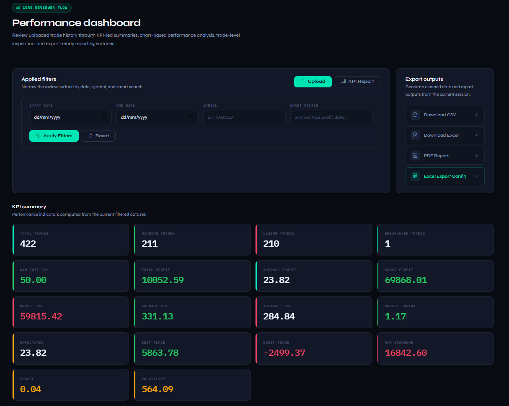
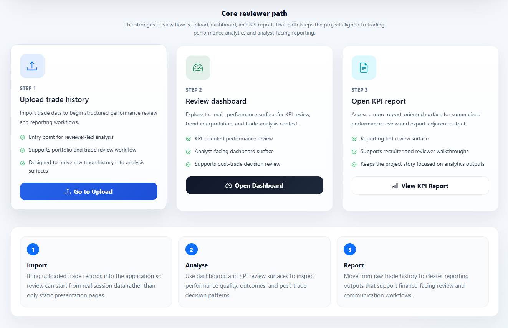
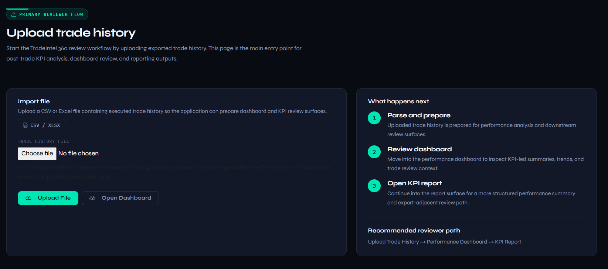
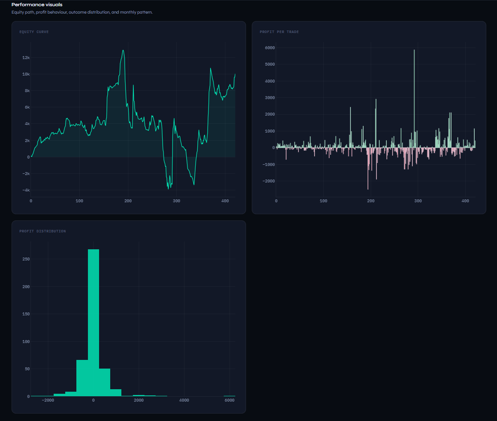
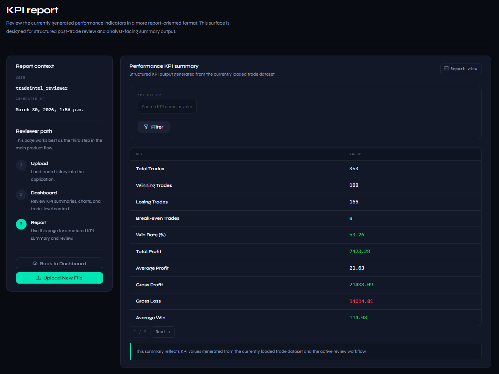
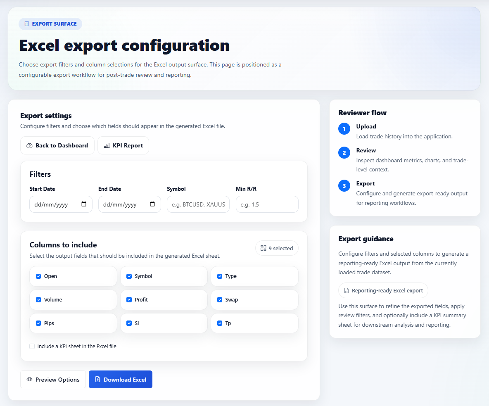
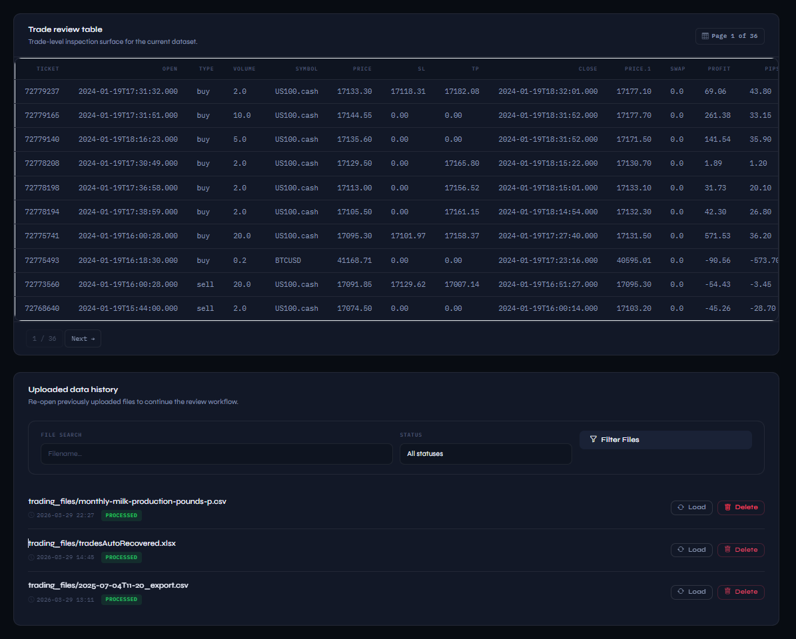

# TradeIntel 360

**Post-trade performance analytics with deterministic CSV/XLSX ingestion, an 18-metric KPI engine, shared request-derived analytical scope, and session-backed reporting/export surfaces.**

Upload a trade history CSV or Excel file. TradeIntel 360 cleans it, stores the cleaned dataset in session, applies a shared request-derived analytical scope, and surfaces the results across the Dashboard, KPI Report, configurable Excel export, and a separate PDF report. The review workflow runs from a single uploaded file and is designed to minimise manual preparation before analysis.


<br>

<table width="100%" cellpadding="0" cellspacing="0" border="0">
  <tr>
    <td align="center">
      
    </td>
  </tr>
  <tr>
    <td align="center" style="padding-top:6px">
      <sub><strong>Performance Dashboard</strong> - KPI summary, equity curve, and export controls</sub>
    </td>
  </tr>
</table>

<br>

---

## What this demonstrates

| Area | Detail |
|---|---|
| **Data pipeline** | Deterministic ingestion -> cleaning -> session-backed cleaned dataset -> request-derived analytical scope -> lineage-aware reporting/export |
| **KPI engine** | 18 deterministic metrics: win rate, profit factor, Sharpe, max drawdown, expectancy, and more |
| **Django patterns** | Authenticated views, session-backed cleaned data, request-derived analytical context, paginated and reporting surfaces |
| **Data visualisation** | Plotly equity curve, P&L distribution, monthly breakdown, segmented win/loss charts |
| **Export pipeline** | Configurable Excel export with shared analytical scope, export-only min_rr refinement, Source / Analysed / Exported row lineage, optional KPI sheet, and ExportMeta; cleaned CSV of the full session dataset; PDF via xhtml2pdf |
| **FinTech domain** | Trade-level data structures, performance metrics, analyst-facing workflow presentation |

---

## Core workflow

```
Upload CSV / XLSX
        |
        v
Deterministic cleaning and validation
        |
        v
Cleaned DataFrame stored in session
        |
        v
Shared request-derived analysis
(start_date / end_date / symbol / q)
        |
        +------------------+------------------+
        |                  |                  |
        v                  v                  v
    Dashboard          KPI Report       Excel Export
        |                  |                  |
        |                  |             optional min_rr
        |                  |                  |
        +--------+---------+                  v
                 |                       Trades sheet
                 v
          Same 18-KPI evidence
```

Lineage:

```
Source Rows -> Analysed Rows -> Exported Rows
```

Dashboard and KPI Report share the same analysed-row scope and the same deterministic 18-KPI evidence. Configurable Excel export starts from that same analytical scope. Optional Min R/R is applied only after that scope, and only to exported Trades rows. The optional Excel KPI sheet remains based on the analysed scope. PDF is a separate reporting surface and is not part of this shared analysis-lineage contract.

Cleaned data is stored in session. Shared analytical controls are start date, end date, symbol, and smart search `q`. Analysis context is recomputed from each request and is not persisted as session state.

---

## Screenshots

<br>

<!-- Row 1: Onboarding + Upload -->
<table width="100%" cellpadding="0" cellspacing="0" border="0"
       style="border:1px solid #1e2d45;border-radius:10px;overflow:hidden;background:#0e1420">
  <tr>
    <td width="50%" valign="top"
        style="padding:20px 12px 20px 20px;border-right:1px solid #1e2d45">
      
    </td>
    <td width="50%" valign="top"
        style="padding:20px 20px 20px 12px">
      
    </td>
  </tr>
  <tr>
    <td valign="top"
        style="padding:10px 12px 16px 20px;border-right:1px solid #1e2d45;border-top:1px solid #1e2d45">
      <sub><strong>Reviewer onboarding path</strong><br>
      Step-by-step workflow guiding reviewers from upload to KPI report</sub>
    </td>
    <td valign="top"
        style="padding:10px 20px 16px 12px;border-top:1px solid #1e2d45">
      <sub><strong>Trade history upload</strong><br>
      CSV or XLSX upload with real-time session loading and status feedback</sub>
    </td>
  </tr>
</table>

<br>

<!-- Row 2: Dashboard KPIs + Charts -->
<table width="100%" cellpadding="0" cellspacing="0" border="0"
       style="border:1px solid #1e2d45;border-radius:10px;overflow:hidden;background:#0e1420">
  <tr>
    <td width="50%" valign="top"
        style="padding:20px 12px 20px 20px;border-right:1px solid #1e2d45">
      
    </td>
    <td width="50%" valign="top"
        style="padding:20px 20px 20px 12px">
      
    </td>
  </tr>
  <tr>
    <td valign="top"
        style="padding:10px 12px 16px 20px;border-right:1px solid #1e2d45;border-top:1px solid #1e2d45">
      <sub><strong>KPI summary panel</strong><br>
      18 computed metrics with date, symbol, and smart search filters</sub>
    </td>
    <td valign="top"
        style="padding:10px 20px 16px 12px;border-top:1px solid #1e2d45">
      <sub><strong>Performance visuals</strong><br>
      Equity curve, profit-per-trade bars, distribution histogram, monthly P&L</sub>
    </td>
  </tr>
</table>

<br>

<!-- Row 3: KPI Report + Excel Export -->
<table width="100%" cellpadding="0" cellspacing="0" border="0"
       style="border:1px solid #1e2d45;border-radius:10px;overflow:hidden;background:#0e1420">
  <tr>
    <td width="50%" valign="top"
        style="padding:20px 12px 20px 20px;border-right:1px solid #1e2d45">
      
    </td>
    <td width="50%" valign="top"
        style="padding:20px 20px 20px 12px">
      
    </td>
  </tr>
  <tr>
    <td valign="top"
        style="padding:10px 12px 16px 20px;border-right:1px solid #1e2d45;border-top:1px solid #1e2d45">
      <sub><strong>KPI report</strong><br>
      Structured KPI summary with report context / analysis scope and a searchable KPI table</sub>
    </td>
    <td valign="top"
        style="padding:10px 20px 16px 12px;border-top:1px solid #1e2d45">
      <sub><strong>Excel export configuration</strong><br>
      Shared analysis controls, export-only Min R/R, column selection, lineage-aware metadata, and optional KPI sheet</sub>
    </td>
  </tr>
</table>

<br>

<!-- Row 4: Trade review table (full width) -->
<table width="100%" cellpadding="0" cellspacing="0" border="0"
       style="border:1px solid #1e2d45;border-radius:10px;overflow:hidden;background:#0e1420">
  <tr>
    <td valign="top" style="padding:20px">
      
    </td>
  </tr>
  <tr>
    <td valign="top"
        style="padding:10px 20px 16px 20px;border-top:1px solid #1e2d45">
      <sub><strong>Trade review table</strong><br>
      Paginated trade-level inspection with smart search across symbol, type, notes, and date</sub>
    </td>
  </tr>
</table>

<br>

---

## KPI engine

The 18 KPI values are computed from the current shared analytical scope.

Shared analytical filters are:

- date range
- symbol
- smart search `q`

Min R/R is an export-only refinement and does not redefine the shared KPI evidence.

**Volume & outcome** - total trades, wins, losses, break-evens, win rate

**Profit & loss** - total profit, average profit, gross profit, gross loss, average win, average loss, profit factor

**Risk metrics** - expectancy, best trade, worst trade, max drawdown

**Statistical** - trade-based Sharpe ratio, per-trade profit volatility

### KPI semantics

- **Win rate** - winning trades divided by all numeric trades, including break-even trades in the denominator.
- **Expectancy** - mean Profit per trade; equivalent in this implementation to Average Profit.
- **Gross Loss / Average Loss** - displayed as positive loss magnitudes.
- **Profit Factor** - Gross Profit divided by Gross Loss. When there are profits but no losses it is shown as `Infinity`; when both Gross Profit and Gross Loss are zero it is shown as `N/A`.
- **Max Drawdown** - largest peak-to-trough decline in cumulative Profit, measured from an initial zero P&L baseline.
- **Volatility** - sample standard deviation of per-trade Profit using `ddof=1`.
- **Sharpe** - trade-based Average Profit divided by per-trade Profit volatility. It is non-annualised and does not subtract a risk-free rate.

> Sharpe is computed as a trade-series ratio, not an annualised institutional Sharpe. Volatility refers to per-trade profit dispersion.

### Analysis parity

For identical `start_date`, `end_date`, `symbol`, and `q` parameters, the Dashboard and KPI Report use the same analysed rows and the same deterministic 18-KPI dictionary. This parity is regression-tested. It does not extend to the PDF report.

### Analysis lineage

```
Source Rows
    |
    | shared analysis filters
    v
Analysed Rows
    |
    | optional export-only Min R/R
    v
Exported Rows
```

- **Source Rows** - rows in the cleaned session dataset before analytical filters.
- **Analysed Rows** - rows remaining after shared `start_date` / `end_date` / `symbol` / `q`.
- **Exported Rows** - analysed rows remaining after optional successfully applied export-only `min_rr`.

Lineage exposes a basename-only source filename. Analytical context is request-derived. Invalid or unavailable Min R/R is not treated as applied.

---

## Export surfaces

**PDF report** - full KPI summary rendered via xhtml2pdf, ready to share or archive. PDF is a separate reporting surface and does not use the Sprint 4 shared analysis-lineage contract.

**Cleaned CSV** - normalised version of the uploaded session dataset. Ordinary cleaned CSV and cleaned Excel downloads remain full cleaned-session exports and do not apply this analytical lineage.

**Configurable Excel export** - built with openpyxl. It supports shared start/end date filters, symbol filter, smart search `q`, configurable column selection, optional export-only Min R/R, a Trades worksheet, an ExportMeta worksheet, and an optional KPI worksheet.

ExportMeta records:

- Source File
- Source Rows
- Analysed Rows
- Exported Rows
- Analysis Filters
- Export-only Min RR

The optional KPI worksheet is based on the shared analytical scope before Min R/R export refinement. Min R/R may reduce Trades worksheet rows. It does not change KPI calculations. Column selection affects fields written to the Trades sheet, not analytical row counts or KPI evidence.

---

## Tech stack

| Layer | Technology |
|---|---|
| Backend | Python 3, Django 5 |
| Data processing | Pandas, openpyxl |
| Visualisation | Plotly |
| PDF generation | xhtml2pdf |
| Auth | Django auth, session management |
| Database | SQLite (local), PostgreSQL-ready |
| UI | Django templates, Bootstrap |

---

## Local setup

```bash
git clone https://github.com/aminul-portfolio/tradeintel-360.git
cd tradeintel-360

python -m venv .venv
source .venv/bin/activate          # Windows: .venv\Scripts\Activate.ps1

pip install -r requirements.txt
python manage.py migrate
python manage.py createsuperuser
python manage.py runserver
```

Visit `http://127.0.0.1:8000`, log in, and upload a trade history file to begin.

**Expected input:** CSV or XLSX with a `Profit` column and common trade fields (date/time, symbol, side/type). Reviewer-safe sample files are included in `sample_data/`.

---

## Review checklist

- [ ] Upload a CSV or XLSX file
- [ ] Confirm cleaned dataset loads
- [ ] Apply date / symbol / smart-search filters
- [ ] Confirm Dashboard analytical scope and KPI recomputation
- [ ] Open KPI Report and confirm the same analytical scope
- [ ] Preview configurable Excel export lineage
- [ ] Apply Min R/R and confirm Analysed Rows and Exported Rows can differ
- [ ] Optionally include the KPI sheet and confirm it reflects the shared analytical scope
- [ ] Generate the PDF report separately

---

## Portfolio context

TradeIntel 360 is the **post-trade performance analytics and review** product in a four-project FinTech portfolio. It focuses on deterministic analytics, analysis lineage, and reporting/export parity.

| Project | Domain |
|---|---|
| DataBridge Market API | Market data ingestion, ETL, API delivery |
| MarketVista Dashboard | Market monitoring and analyst visibility |
| RiskWise Planner | Pre-trade risk planning and scenario modelling |
| **TradeIntel 360** | **Post-trade performance analytics and review** |

---

## Target roles

Data Analyst (Finance / Trading) | Analytics Engineer (FinTech) | BI / Reporting Analyst | Python/Django data-product roles | Performance reporting and trade-review workflows in finance environments
